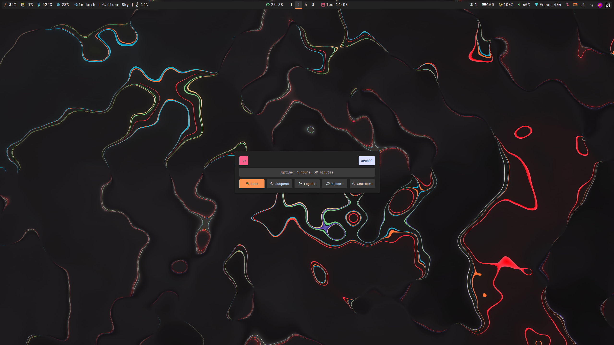
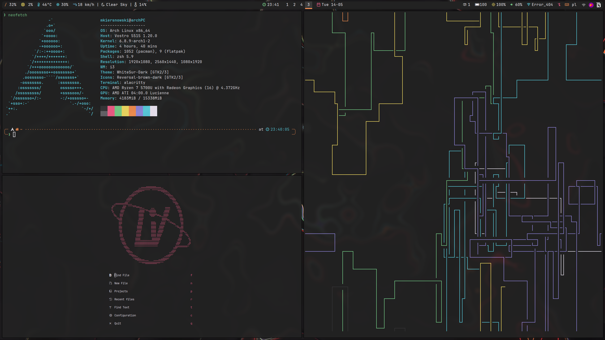

<p align='center'>
    
    
    
</p>

# dotfiles
My dotfiles configuration for Arch Linux 

# Configuration
| Tool | Arch Linux |
|:-----|:-----------|
| Terminal | Alacritty |
| Shell | zsh |
| Window manager | i3 |
| File manager | Thunar |
| Bar | Polybar |
| Launcher | Rofi |
| Screenshots | Flameshot |
| Lockscreen | betterlockscreen |
| Greeter | SDDM |

# Screenshots

## Rofi


## Power menu


## Applications



# How to install the dotfiles.

1. create an alias:
`alias dotfiles='/usr/bin/git --git-dir=$HOME/.dotfiles/ --work-tree=$HOME'`

2. ignore the clone folder:
`echo ".cfg" >> .gitignore`

3. Clone the repository:
`git clone --bare <git-repo-url> $HOME/.dotfiles`

4. Checkout the actual content form the bare repository into your `$HOME`:
`dotfiles checkout`

NOTE: This action might result in an error saying that files would be overwritten.
Solution is, firstly backup those files using:
```
mkdir -p .config-backup && \
config checkout 2>&1 | egrep "\s+\." | awk {'print $1'} | \
xargs -I{} mv {} .config-backup/{}
```
after the backup remove the conflict files and run `dotfiles checkout` command again.

5. Set the flag `showUntrackedFiles` to `no` on this specific (local) repository:
`dotfiles config --local status.showUntrackedFiles no`

6. All done! Now you can manage your dotfiles with git, example:
```
dotfiles status
dotfiles add .zshrc
dotfiles commit -m "adding .zshrc"
dotfiles push
```
